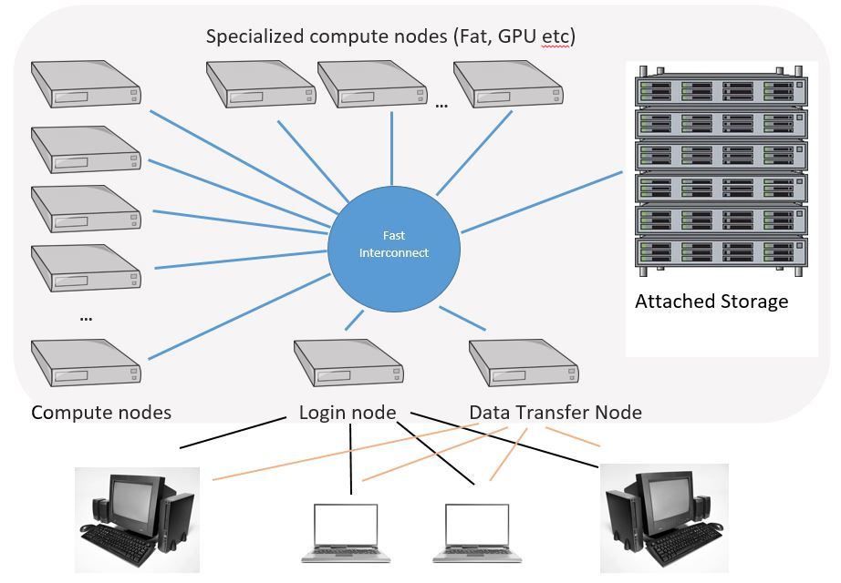

High performance computing (HPC) refers to the high speed calculations and data processing ability. A modern PC or even mobile devices could provide up to 5 billions calculations per CPU core per second, and a more powerful workstation could assemble more than 50 CPU cores and multiples GPU in a single chassis unit. However the computation power of a single PC is still limited, how could we boost up the calculation speed when we have multiple devices? The solution is the concept of HPC clusters.

## How Does HPC Cluster Work?
The HPC cluster is an assembly of one or more computational devices, which can be divided into three main components:
- Nodes
- Network
- Storage

The HPC architecture connects multiple computers via networks to form a cluster. In clustering we name the computers as "nodes". Each node may carry specific functions including job scheduling and distribution, GPU computation, heterogeneous CPU architecture computations (ARM, FPGA nodes) and data storage. Even though individual devices may only carry very low computational ability, every node are playing important role in terms of resource leveraging. The components operates seamless together to complete a diverse set of tasks.

### Detailed device list of HPC cluster

- Headnode or login node, where users log in
- Specialized data transfer node
- Regular compute nodes (where majority of computations is run)
- "Fat" compute nodes that have at least 1TB of memory
- GPU nodes (on these nodes computations can be run both on CPU cores and on a Graphical Processing Unit)
- Switch and router to connect all nodes

## How to Maximize the HPC Ability?
To maximize the power of HPC clusters, one may put every nodes in full loading whole time and keep each components keep pace with each others. The data storage nodes take responsibility of raw data ingestion and analyzed data output. To transfer data among storage nodes and computational nodes, a fast network and caching technique for data input/output is one of the keystones to boost up processing speed. To maintain such coordinated works, a bunch of software toolkits are developed to automate the process.

## When will I Need a HPC cluster for Computational Radiology?
Take a look at this [post](https://www.reddit.com/r/MachineLearning/comments/6xzv3h/d_which_gpu_scheduler_are_you_using_in_your/). Docker container is an easy to use tool for AI development, all environments are ready with single docker pull command. This is only the case when computational resources are readily available, however this is never a case comes to GPU computation. Imagine 20 PhD students in same department share a 8 card PC, this will eventually result in computer resources monopolization. The scheduling technique in HPC clusters could bring in a fair usage environment to every user of the shared devices.

## Selection of Distributed Resources Management Software
There are a number of cluster resources management systems available under Linux:
- [Slurm](https://slurm.schedmd.com/overview.html)
- [Kubernetes](https://kubernetes.io/)
- [Torque PBS](https://help.ubuntu.com/community/TorquePbsHowto)
- [HTCondor (minihtcondor for single node cluster)](https://research.cs.wisc.edu/htcondor/)
- and more...

Each of the resource management system has it's unique features. The combined usage of Kubernetes and Docker provides flexible cluster orchestration at enterprise level. What if I am only a small development team and wish to automate GPU scheduling? Slurm do support GPUs as the GRES (generic resource) and thus would be the preferable management for small cluster system. Slurm has been supported in the most popular cloud services providers including AWS, Azure and GCP, thus provides high flexibility to mix private and public clusters.

In the coming posts there will be hand on steps to setup a Slurm cluster.

## References
- [Building a Raspberry Pi Cluster](https://medium.com/@glmdev/building-a-raspberry-pi-cluster-784f0df9afbd)
- [Deploying a Burstable and Event-driven HPC Cluster on AWS Using SLURM](https://aws.amazon.com/blogs/compute/deploying-a-burstable-and-event-driven-hpc-cluster-on-aws-using-slurm-part-1/)
- [Run Swarm and Kubernetes Interchangeably](https://www.docker.com/products/orchestration)
- [Integrating Kubernetes with Docker Enterprise Edition 2.0 – Top 10 Questions from the Docker Virtual Event](https://blog.docker.com/2018/05/integrating-kubernetes-docker-enterprise-edition-2-0-top-10-questions-docker-virtual-event/)
