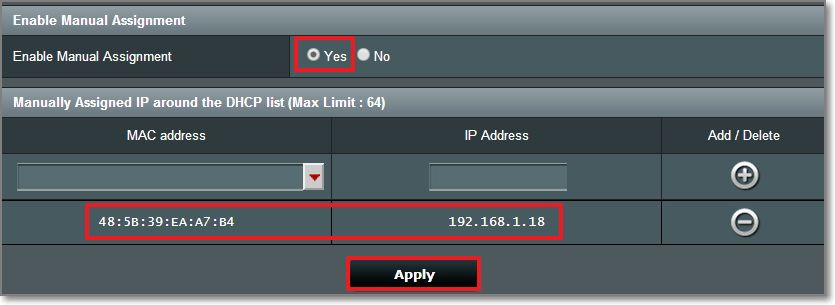
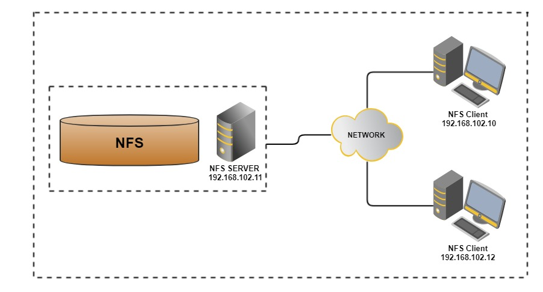

To setup a HPC cluster, you should always get the hardware ready first.

## Step 0: Hardware Setup
Here we demonstrate the setup of a small cluster unit with 1 head node and 3 child nodes. For simplicity we will the CPU architecture is assume to be x64, though similar setup also works on ARM nodes like Raspberry Pi.

### Parts list
- x64 architecture computers with Nvidia GPUs x 4 (1 head + 2 child nodes, recommended identical devices, GPUs should support CUDA 8.0 or above)
- Network router with minimum 4 ports x 1 (expandable via switches, 1000Gbps recommended)

This setup is scalable to as many nodes as you have, you may also have a separate network attached storage to the system for large data I/O. Here we will use the head node to act as the storage node. 

## Step 1: Install OS
It would be far easier to have all cluster nodes in same OS. To reduce graphical computation resources, I highly recommend Ubuntu Server for child nodes. If you are comfortable with SSH communications and CLI Linux environment, install Ubuntu Server for head node as well, or else you may choose any Ubuntu Desktops with same distribution number as the child nodes. This is to maintain the same dependency environment across whole cluster and software can be installed simultaneously across all nodes.

### Choice of OS
- GUI head node 
	- [Ubuntu Desktop 18.04 LTS](https://ubuntu.com/download/desktop) (install in head node only)
	- [Ubuntu Server 18.04 LTS](https://ubuntu.com/download/server) (install in all child nodes)

- CLI head node
	- [Ubuntu Server 18.04 LTS](https://ubuntu.com/download/server) (install in all nodes)

Both GUI and CLI works the same afterward...as long as all Slurm setups are accomplished under CLI environment...Linux newbies may feel more comfortable with GUI version as long as the file editing can be done without knowledge of CLI editors like Nano or Vim. Under GUI Linux you can call up the CLI terminal with `Ctrl` + `Alt` + `T`.

## Step 2: Network Setup


It is essential to keep all nodes IPs constant over time to guarantee stable communication between nodes. In most modern day routers users may login to the admin interface to bind device IP according their MAC addresses under DHCP. 

## Step 3: Node Setup
> Slurm expects hosts to be named with a specific pattern: `<nodename>``<nodenumber>`. When choosing the hostname for the nodes, it would be convenient to name them systemically in order. (e.g. `node01`,`node02`,`node03`,`node04`,...)

### Hostname
Now we may setup the hostname:

```bash
sudo hostname node01       	# whatever name you chose
sudo vim /etc/hostname    	# change the hostname here too
sudo vim /etc/hosts       	# change the hostname to "node01"
```

### System Time
Node communication requires accurate time synchronizations. The `ntpdate` package will periodically synchronize OS time in the background.

```bash
sudo apt-get install ntpdate -y
```

### Reboot
```bash
sudo reboot
```

**Repeat the procedure for all nodes but each of them with a different node number.**

## Shared Storage


> Storage node is one the three key components of the HPC cluster. In order for the softwares/ data be able to run on any of the nodes in the cluster, each node should be able access to the same files. In a large scale cluster there is often an individual node for data storage purposes.

In this mini setup we will use the head node to act as the storage node. A specific folder will be exported as a network file system (NFS) and mounted among all nodes. If you have a separate network attached storage (NAS), you may mount that on all nodes as NFS.

### Create and Export NFS directory
1.  Create mount directory in head node
```bash
sudo mkdir /clusterfs #create NFS directory at /clusterfs
sudo chown nobody.nogroup -R /clusterfs #/clusterfs now owned by pseduo user
sudo chmod 777 -R /clusterfs #R/W permission for all users to the NFS directory
```
2. Export the NFS directory
You need to host a NFS server in the head node.
	1. Install NFS server
	```bash
	sudo apt install nfs-kernel-server -y
	```
	2. Export the NFS directory
	Add following lines to `/etc/exports`:
	```
	/clusterfs    <ip-address>/2(rw,sync,no_root_squash,no_subtree_check)
	```
	where `<ip-address>` is the IP of the head node. You may check with router interface or via `ifconfig`. This permission setting allows any clients to mount the shared directory. e.g. if the LAN address is `192.168.0.123`, you will have
	```
	/clusterfs    192.168.0.123/24(rw,sync,no_root_squash,no_subtree_check)
	```

	- `rw` provides client R/W access
	- `sync` forces changes to be written on each transaction
	- `no_root_squash` enables the root users of the clients to write files as root permissions
	- `no_subtree_check` prevents errors caused by a file being changed while another system is using it.
3. Update the NFS kernel server
```bash
sudo exportfs -a
```

### Mount the NFS directory
Now we have exported the NFS directory from head node to the network. On child nodes you need mount in order to work like a single directory. **Repeat the following procedures for all child nodes**

1. Install NFS client
```bash
sudo apt install nfs-common -y
```
2.  Create mount directory in child nodes
Guess what, this is exactly the same you have done for the head node
```bash
sudo mkdir /clusterfs #create NFS directory at /clusterfs
sudo chown nobody.nogroup -R /clusterfs #/clusterfs now owned by pseduo user
sudo chmod 777 -R /clusterfs #R/W permission for all users to the NFS directory
```

3. Auto mounting
We want the NFS directory automatically mounted on the child nodes when they boot.
	1. Edit `/etc/fstab` by adding:
	```
	<master node ip>:/clusterfs    /clusterfs    nfs    defaults   0 0
	```
	This line refers to mounting shared directory at head node to the "local" folder `/clusterfs` as NFS.
	2. Actually mount the drive:
	`sudo mount -a`
	Once you create a file in any node's `/clusterfs` it will be RWable in all other nodes.

The hardware part is done. Coming next we will start to install the job scheduler **Slurm**

## References

[Building a Raspberry Pi Cluster](https://medium.com/@glmdev/building-a-raspberry-pi-cluster-784f0df9afbd)
[Slurm documentation](https://slurm.schedmd.com/documentation.html)
[Running a Job on HPC using Slurm](https://hpcc.usc.edu/support/documentation/slurm/)