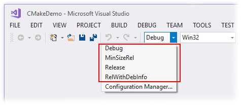

**CMake** is a cross-platform open-source software for C++ dependency management. The software generate adequate build system according to different compilers and OS. It supports hierarchial folder structures and multiple third party libraries. The software is used in conjunction with native build environments such as Make, Qt Creator, Ninja, Android Studio, Apple's Xcode, and Microsoft Visual Studio. In short, CMake could generate compiler and workspace specific C/C++ build system with a single `CMakeLists.txt` file.

## Hello World
The following source code files (assumed to be put into src/ folder) demonstrate compilation of basic hello world program called hello written in C++.

```cpp
// src/Hello_world.cc
#include <iostream>

int main()
{
    std::cout << "Hello, world!\n";
}
```

```CMake
# src/CMakeLists.txt
cmake_minimum_required(VERSION 3.10)

# set the project name
project("Hello World")

# executable to compile
add_executable(hello "Hello_world.cc")
```

In order for CMake to work you have to run the following bash script (placed next to the src/ folder assuming that you are working under Linux-based OS and have all necessary dependencies installed):

```bash
#!/usr/bin/env bash
# Place this file next to src/ folder
cmake -S src/ -B build/ # Generates building files into build/ folder
cmake --build build/    # Actually builds executable
build/hello             # => Hello, world! - output from compiled program
```

For a detailed tutorial of `CMakeLists.txt`, refers to derekmolloy.ie: http://derekmolloy.ie/hello-world-introductions-to-cmake/.

## CMake Basic Workflow
1. Edit `CMakeLists.txt`: CMake will configure the build system with user provided `CMakeLists.txt`.
2. Generate Build Dependencies: CMake will generate necessary build files according to different platforms and compilers (-G <generator>). For example you may choose to output `Makefile` under Linux/Unix/MinGW , `*.sln` with MSVC in Windows, or `*.xcodeproj` with XCode in MacOS.

## Different Interfaces of CMake Build
CMake comes with 3 different binaries for different interface build:
- `cmake`: Command line interface.
- `cmake-gui`: Graphical user interface of cmake.
- `ccmake`: Console equivalent of `cmake-gui`. Not available in Windows distribution.

The three software can cross use after configuration. i.e. You may use `cmake` method to generate the initial build configuration files, then edit the dependencies with `cmake-gui` or `ccmake` interface for convenience.

### Command Line (cmake)
To configure and generate CMake build system under command line mode, type the following command in Terminal:
```bash
cmake <src_dir> --build <build_dir> -G <generator>
```

- `<src_dir>` refers to the folder containing root `CMakeList.txt` file.
- `<build_dir>` specifies the binary build directory.
- `<generator>` specifies the build system to be used, e.g. `"Visual Studio 14 2015 Win64"`, `"Unix Makefiles"`

Another commonly used CLI method for Linux/Unix system:

```bash
cd <src_dir>    # move to source code directory
mkdir build     # create build directory
cd build        # move into build directory
cmake ..        # run cmake configuration and generation build files
make            # compile the code
install         # install the build files (optional)
```
### Graphical User Interface (cmake-gui)
1. Double click on `cmake-gui`

    
    1. Similar to `cmake`, you need to provide source code location and desired build directory.
    2. Click `Configure`

2. Choose the generator that suitable for your compiler
    
    
    
3. After the initial configure step, the GUI will show you a list of cache variables, similar to the list you see when you run `cmake -L -N` from the command line.

    
    
    New cache variables are highlighted in red. (In this case, that’s all of them.) If you click `Configure` again, the red highlights will disappear, since the variables are no longer considered new.

    Change the variables when necessary. This step is usually essential for projects that depends on third party libraries.
    
    Once you’ve customized the cache variables, click `Generate`. This will generate the build pipeline in the binary folder. You can then use it to build your project.

### Console GUI (ccmake)
`ccmake` is the console equivalent to `cmake-gui`. Like the GUI, it lets you set cache variables interactively. When CLI is handy to manage cmake configurations or running CMake in remote machine, ccmake will show it's superiority over the two other methods

`ccmake` is run with terminal similar to `cmake`
```bash
cd <src_dir>    # move to source code directory
mkdir build     # create build directory
cd build        # move into build directory
ccmake ..       # run ccmake configuration and generation build files
```

 

- Press `c` to start configuration
- Press `t` to toggle advance mode
- Use keyboard arrow keys to navigation around, with `Enter` key to change the values.
- Path autocomplete is available with `Tab` key
- After configuration, press `c` to re-configure again and `g` to generate the build files. ccmake will close after generation

To build the binary:
```bash
cd ../build # navigate to build directory
make        # compile the binary
install     # install the build files (optional)
```

## CMake on Different Platforms
### Unix Makefiles (Unix)
CMake generates a Unix makefile by default when run from the command line in a Unix-like environment. Of course, you can generate makefiles explicitly using the `-G` option. When generating a makefile, you should also define the `CMAKE_BUILD_TYPE` variable. Assuming the source folder is the parent:

```bash
cmake -G "Unix Makefiles" -DCMAKE_BUILD_TYPE=Debug ..
```

You should define the `CMAKE_BUILD_TYPE` variable because makefiles generated by CMake are single-configuration. Unlike a Visual Studio solution, you can’t use the same makefile to build multiple configurations such as `Debug` and `Release`. A single makefile is capable of building exactly one build type. By default, the available types are `Debug`, `MinSizeRel`, `RelWithDebInfo` and `Release`. Watch out – if you forget to define `CMAKE_BUILD_TYPE`, you’ll probably get an unoptimized build without debug information, which is useless. To change to a different build type, you must re-run CMake and generate a new makefile.

Once the makefile exists, you can actually build your project by running make. By default, make will build every target that was defined by `CMakeLists.txt`.

- Compile all targets by default:
    ```bash
    make
    ```
- Compile specific target:
    ```bash
    make <target>
    ```
- Parallel compile:
    You can also parallelize the build by passing `-j 4`(4 refers to 4 cores, you may use a higher number if the machine is available) to `make`.
    ```bash
    make -j <num_of_threads>
    ```

The makefile generated by CMake detects header file dependencies automatically, so editing a single header file won’t necessarily rebuild the entire project.

### Microsoft Visual Studio (Windows)
We’ll generate a Visual Studio `.sln` file from the CMake command line. If you have several versions of Visual Studio installed, you’ll want to tell cmake which version to use. Again, assuming that the source folder is the parent:

```bat
cmake -G "Visual Studio 14 Win64" ..
```

The command will generate a Visual Studio `.sln` file for a ***32-bit*** build. There are no multiplatform `.sln` files using CMake, so for a ***64-bit*** build, you must specify the 64-bit generator:

```bat
cmake -G "Visual Studio 15 2017" ..
cmake -G "Visual Studio 15 2017 Win64" ..

cmake -G "Visual Studio 12" ..
cmake -G "Visual Studio 12 Win64" ..
cmake -G "Visual Studio 12 2013" ..
cmake -G "Visual Studio 12 2013 Win64" ..

cmake -G "Visual Studio 14" ..
cmake -G "Visual Studio 14 Win64" ..
cmake -G "Visual Studio 14 2015" ..
cmake -G "Visual Studio 14 2015 Win64" ..
```
Double click the resulting `.sln` file in Visual Studio, go to the `Solution Explorer` panel, right-click the target you want to run, then choose `Set as Startup Project`. Build and run as you normally would.

 

Note that CMake adds two additional targets to the solution: `ALL_BUILD` and `ZERO_CHECK`. `ZERO_CHECK` automatically re-runs CMake when it detects a change to CMakeLists.txt. `ALL_BUILD` usually builds all other targets, making it somewhat redundant in Visual Studio. If you’re used to setting up your solutions a certain way, it might seem annoying to have these extra targets in your `.sln` file, but you get used to it. CMake lets you organize targets and source files into folders, but I didn’t demonstrate that in the CMakeDemo sample.

 

Like any Visual Studio solution, you can change build type at any time from the Solution Configuration drop-down list. The CMakeDemo sample uses CMake’s default set of build types. `Release` configuration doesn’t produce any debug information yet a much faster runtime than `Debug`. If your program consist of large size file i/o or complex computation process, `Release` version will provide a much swift and fast executable than `Debug` one.

### Ninja (Windows/Unix)
CMake also exposes a Ninja generator. Ninja is similar to make, but faster. It generates a build.ninjafile, which is similar to a Makefile. The Ninja generator is also single-configuration. Ninja’s `-j` option auto detects the number of available CPUs.

### Other Compilers (Xcode Qt Creator）
Other CMake Features
* You can perform a build from the command line, regardless of the generator used: cmake --build . --target CMakeDemo --config Debug
* You can create build pipelines that cross-compile for other environments with the help of the CMAKE_TOOLCHAIN_FILE variable.
* You can generate a compile_commands.json file that can be fed to Clang’s LibTooling library.

## Recommended IDE for CMake
- Microsoft Visual Studio
    - Platform: Windows
    - Complier: MVSC
- Qt Creator
    - Platform: Windows, Linux, MacOS
    - Complier: MSVC, GCC, MinGW
- CLion (Cross Platform)
    - Platform: Windows, Linux, MacOS
    - Complier: GCC, MinGW

## References
- [CMake Official Site](https://cmake.org/)
- [CMake Wiki Page](https://en.wikipedia.org/wiki/CMake)
- [CMake Github Page](https://github.com/Kitware/CMake)
- [Introduction to CMake by Example](http://derekmolloy.ie/hello-world-introductions-to-cmake/)
- [Quick CMake tutorial with CLion](https://www.jetbrains.com/help/clion/quick-cmake-tutorial.html)