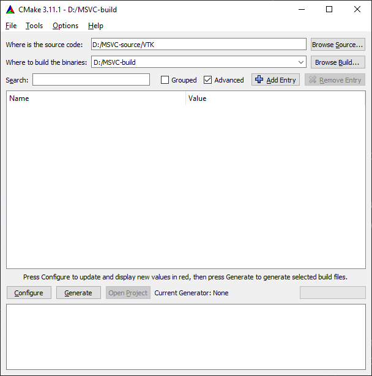
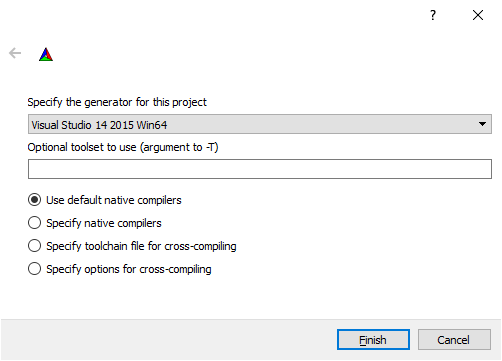
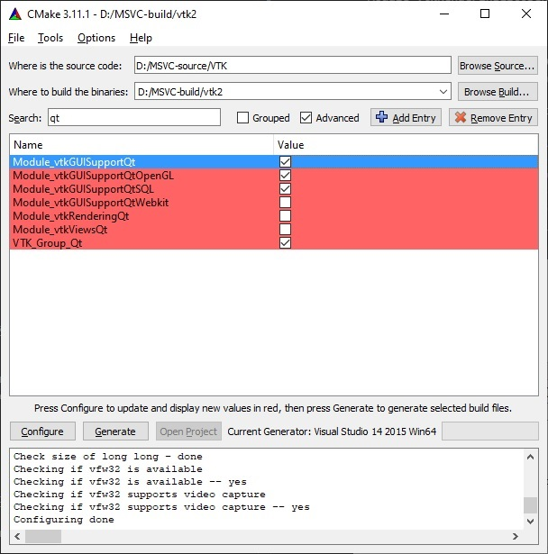
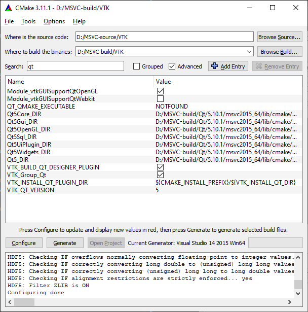
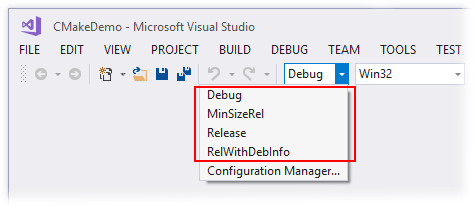
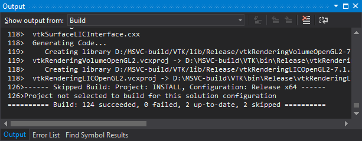
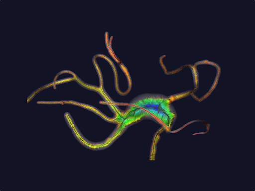

To develop desktop medical image software, several essential C++ libraries are recommended for GUI design, graphical rendering and image processing. Here we will provide a detailed instruction on the configuration and compilation of the toolchain.

The toolchain we recommended is cross platform applicable (Windows, MacOS, Linux). The procedure works almost the same on different OS. Also the suggested library packages also provide Python interface for users who are not familiar with C++ coding.

## Dependencies
**Beware of software version and build sequence. Wrong version may cause compilation error.**

- [CMake](https://cmake.org/)
- [Qt 5.10.1](https://www.qt.io/)
- [VTK 8.2.0](https://vtk.org/)
- [OpenCV 3.4](https://opencv.org/)
- [ITK 4.13.3](https://itk.org/)

If trying to build with `Qt-5.12` and `Microsoft Visual Studio 2019`, then build will fail with the error `error LNK2019: unresolved external symbol "__declspec(dllimport) public: __cdecl QLinkedListData::QLinkedListData(void)"`. The solution is to either change the toolset version to an earlier one (e.g., Visual Studio 2015) or upgrade Qt (e.g., use Qt-5.15 with Visual Studio 2019).

It is known that newer version of ITK and VTK is not compatible with VMTK 1.4.

Since the libraries relies on one another, sequence of build is also essential to bind the toolchain. Recommended flow is `Qt`->`VTK`->`OpenCV`->`DCMTK(optnional)`->`ITK`->`others`

### Associate Python Versions
For users who would like to develop with Python interface, [Anaconda](https://www.anaconda.com/) would include most of the dependent libraries like pyqt and vtk. You may install other necessary packages like OpenCV or ITK via pip or conda.

||C++|Python|
|---|---|---|
|GUI|Qt|pyqt|
|Graphical Rendering|VTK|vtk|
|Image Processing (2D/3D/N-D)|ITK|SimpleITK|
|Image Processing (2D)|OpenCV|OpenCV|

Note that SimpleITK is a lite version of ITK that provides convenient manipulation methods for Python users. ITK also provide Python interface yet is not a popular choice for its relative complex syntax.

## Install Process
Here we will demonstrate the install procedures for MSVC 2015. For Unix you may follow the CMake terminal build guild.

We recommend to build the toolchain with following folder hierarchy:

- Style 1:
    ```
    .
    ├── source
    │   ├── qt-installer.exe
    │   ├── vtk
    │   ├── itk
    │   └── ...
    ├── build
    │   ├── qt
    │   ├── vtk
    │   ├── itk
    │   └── ...
    ```

- Style 2:
    ```
    .
    ├── qt
    ├── vtk
    │   ├── build
    │   ├── <source-code>
    │   └── ...
    ├── itk
    │   ├── build
    │   ├── <source-code>
    │   └── ...
    ├── ...
    ```

### Qt
1. Download [Open Source Qt installer](https://www.qt.io/download-open-source) from official site
2. Follow the install instruction with the correct compiler version.

**Note**: Qt does not provide 64bit MinGW pre-compiled version. 

### VTK

1. Clone the source code 
    ```bash
    git clone -b v8.2.0  https://github.com/Kitware/VTK.git
    ```
2. Open CMake and choose the source code directory and binary build directory. Here we choose `Style 1` folder structure.

    

3. Press `Configure` and choose `Visual Studio 14 2015 Win64` for 64bit build. Wait until first time configuration complete. This step may take around 10 min.

    

4. Change the following build options. Then press `Configure` again to take effective. Some options like `Qt5_DIR` and `VTK_QT_VERSION` will only appear after `VTK_Group_Qt` is checked and configured. You may need to configure several times before all the necessary values are set.
    ``` cmake
    # speed up the build
    BUILD_DOCUMENTATION:BOOL=OFF 
    BUILD_EXAMPLES:BOOL=OFF
    BUILD_TESTING:BOOL=OFF 
    # must check shared library build to export for future use
    BUILD_SHARED_LIBS:BOOL=ON
    # OpenGL stuff
    Module_vtkImagingOpenGL2:BOOL=ON
    Module_vtkIOExportOpenGL2:BOOL=ON
    Module_vtkRenderingLICOpenGL2:BOOL=ON
    #
    VTK_QT_VERSION:STRING=5
    VTK_Group_Qt:BOOL=ON
    Module_vtkGUISupportQt:BOOL=ON
    Module_vtkGUISupportQtOpenGL:BOOL=ON
    Module_vtkGUISupportQtSQL:BOOL=ON
    Module_vtkGUISupportQtWebkit:BOOL=OFF
    Qt5_DIR:PATH=${Qt5_DIR}
    Qt5Core_DIR:PATH=${Qt5_DIR}/Core
    Qt5Gui_DIR:PATH=${Qt5_DIR}/Gui
    Qt5OpenGL_DIR:PATH=${Qt5_DIR}/OpenGL
    Qt5Sql_DIR:PATH=${Qt5_DIR}/Sql
    Qt5UiPlugin_DIR:PATH=${Qt5_DIR}/UiPlugin
    Qt5Widgets_DIR:PATH=${Qt5_DIR}/Widgets
    ``` 

     

    Error box will popup after choosing `VTK_Group_Qt`. You need to provide the correct path to make the configuration success.

    `${Qt5_DIR}` is located at `<qt-install-directory>/5.10.1/msvc2015_64/lib/cmake` if you are using Qt 5.10.1 and MSVC 2015.


    The new values are highlighted in red. If the configuration is complete you will see `Configuring done` at the lower part output, or else error messages will be displayed.

    

5. Click `Generate` for C++ build.
6. Double click the resulting `.sln` file in the binary build folder and choose build version `Debug` and `x64`.
    
7. Press `Build` -> `Build Solution` and wait until all build success.
    
8. Choose `Release` build type and redo step 7 again.
9. For Unix Makefile (Linux/Unix) users, after step 5 you can use `make` command to build the library. Similar build method applies for XCode.

### OpenCV
1. Clone the source code 
    ```bash
    git clone -b v3.4  https://github.com/opencv/opencv
    ```
2. Open CMake and choose the source code directory and binary build directory. Here we choose `Style 1` folder structure.

3. Press `Configure` and choose `Visual Studio 14 2015 Win64` for 64bit build. Wait until first time configuration complete. This step may take around 10 min.

4. Change the following build options. Then press `Configure` again to take effective. 

    ``` cmake
    BUILD_DOCS:BOOL=OFF
    BUILD_EXAMPLES:BOOL=OFF
    BUILD_TESTS:BOOL=OFF
    BUILD_SHARED_LIBS:BOOL=ON
    BUILD_WITH_STATIC_CRT:BOOL=ON
    BUILD_opencv_java:BOOL=OFF
    BUILD_opencv_python3:BOOL=OFF
    WITH_MATLAB:BOOL=OFF
    
    # Choose ON if you need OpenCV with CUDA acceleration
    WITH_CUDA:BOOL=OFF
    ```

### ITK
1. Clone the source code 
    ```bash
    git clone -b v4.13.3  https://github.com/Kitware/ITK.git
    ```
2. Open CMake and choose the source code directory and binary build directory. Here we choose `Style 1` folder structure.

3. Press `Configure` and choose `Visual Studio 14 2015 Win64` for 64bit build. Wait until first time configuration complete. This step may take around 10 min.

4. Change the following build options. Then press `Configure` again to take effective. 
    ``` cmake
    BUILD_DOCUMENTATION:BOOL=OFF
    BUILD_EXAMPLES:BOOL=OFF
    BUILD_SHARED_LIBS:BOOL=ON
    BUILD_TESTING:BOOL=OFF

    # VTK
    Module_ITKVtkGlue:BOOL=ON
    VTK_DIR:PATH=${CMAKE_BINARY_DIR}/VTK-build

    # OpenCV
    Module_ITKVideoBridgeOpenCV:BOOL=ON
    OpenCV_DIR:PATH=${CMAKE_BINARY_DIR}/OpenCV-build

    # VMTK requires class in ITKReview
    Module_ITKReview:BOOL=ON
    ITK_USE_SYSTEM_DOUBLECONVERSION=ON
    ```
5. Generate the solution and build

## Other Medical Image Libraries
You can extend the toolchain with other medical image related libraries

###  [Common Toolkit (CTK)](https://github.com/commontk/CTK)
A set of common support code for medical imaging, surgical navigation, and related purposes.
```cmake
BUILD_DOCUMENTATION:BOOL=OFF
CTK_BUILD_EXAMPLES:BOOL=OFF
CTK_BUILD_SHARED_LIBS:BOOL=ON
BUILD_TESTING:BOOL=OFF
CTK_ENABLE_DICOM:BOOL=ON
CTK_LIB_DICOM/Core:BOOL=ON
CTK_LIB_DICOM/Widgets:BOOL=ON
CTK_QT_VERSION:STRING=5
Qt5_DIR:PATH=${Qt5_DIR}
```

### [DCMTK](https://github.com/DCMTK/dcmtk)
DCMTK is a collection of libraries and applications implementing large parts the DICOM standard. It includes software for examining, constructing and converting DICOM image files, handling offline media, sending and receiving images over a network connection, as well as demonstrative image storage and worklist servers. DCMTK is is written in a mixture of ANSI C and C++. It comes in complete source code and is made available as "open source" software.
```cmake
 CMAKE_INSTALL_PREFIX:PATH=${DCMTK_INSTALL_DIR}
```

### [Vascular Modeling Toolkit (VMTK)](https://github.com/vmtk/vmtk)


The Vascular Modeling Toolkit is a collection of libraries and tools for 3D reconstruction, geometric analysis, mesh generation and surface data analysis for image-based modeling of blood vessels.

### [Image Guided Surgery Software Toolkit (IGSTK)](https://github.com/Kitware/IGSTK)
The Image-Guided Surgery Toolkit (IGSTK) is a framework that integrates a set of high-level components with low-level open source software libraries and application programming interfaces (APIs) from hardware vendors. In addition to its interface to common tracking hardware (e.g., Aurora from Northern Digital Inc.), IGSTK has a GUI.

### [TubeTK](https://github.com/InsightSoftwareConsortium/ITKTubeTK)
TubeTK is an open-source toolkit for the segmentation, registration, and analysis of tubes and surfaces in images.

Tubes and surfaces, as generalized 1D and 2D manifolds in N-dimensional images, are essential components in a variety of image analysis tasks. Instances of tubular structures in images include blood vessels in magnetic resonance angiograms and b-mode ultrasound images, wires in microscopy images of integrated circuits, roads in aerial photographs, and nerves in confocal microscopy.

## References
- [ITK + VTK + QT on Window 7 64bit and Visual Studio 2010 Pro 32bit project](http://guitarcplusplus.blogspot.com/2013/02/itk-vtk-qt-on-window-7-64bit-and-visual.html)

