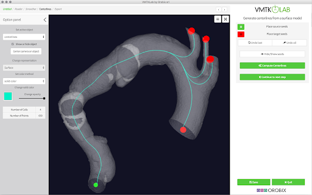

**The Vascular Modeling Toolkit (VMTK)** is library collection for 3D reconstruction, geometric analysis, mesh generation and surface data analysis for image-based modeling of blood vessels. The toolkit is developed by Orobix srl whicch can run standalone with VMTK scripts, Python or C++ library, or as an extension to the medical image processing platform 3D Slicer.

The standalone and Python (Pype) method is described in detail in the [tutorial section of VMTK official site](http://www.vmtk.org/tutorials/). Here we provide the instruction for C++ users to integrate VMTK with CMake medical image processing toolchain.

## Compile C++ Interface from Source
For developers interested to develop vascular modeling toolkit with CMake medical image processing toolchain, you should first get familiar with [CMake and the Qt-VTK-ITK build](./2020-12-16-CMake-Medical-Image-Toolchain.md) procedures. 

### CMake Configuration
VMTK provide SuperBuild options for standalone build. Here we would prefer to use our own VTK-ITK toolchain for greater control on dependencies.

#### ITK Configuration
Make sure ITK is built with `Module_ITKVtkGlue:BOOL=ON` to have ITK-VTK bind. Following options are necessary for VMTK dependency or else built error will appear:

```cmake
Module_ITKReview:BOOL=ON
ITK_USE_SYSTEM_DOUBLECONVERSION=ON
```

#### VMTK Configuration

``` cmake
BUILD_DOCUMENTATION:BOOL=OFF
BUILD_SHARED_LIBS:BOOL=ON
VTK_VMTK_WRAP_PYTHON:BOOL=OFF

# Use system VTK and ITK
VMTK_USE_SUPERBUILD:BOOL=OFF
USE_SYSTEM_VTK:BOOL=ON
USE_SYSTEM_ITK:BOOL=ON
```

## VMTK in C++ and Python
You should first get yourself familiar with VTK coding in C++. VMTK works very similar to VTK smartpointer syntax ([VTK C++ Example](http://www.vtk.org/Wiki/VTK/Examples/Cxx)). Once you understand the working principle of VTK, you will get used to VMTK.

### vmtkScripts
VMTK work as standalone software with PypeS script. The VMTK PypeS script are available on the [Github repo](https://github.com/vmtk/vmtk/tree/master/vmtkScripts) and you may checkout the basic tutorial [here](http://www.vmtk.org/tutorials/PypesBasic.html).

### Change from Python to C++
As a basic illustration on converting vmtkScripts to C++ development, we use the example of centerline extraction filter (https://github.com/vmtk/vmtk/blob/master/vmtkScripts/vmtkcenterlines.py).

What we most concern is the `Execute` function, where PypeS actually call VMTK functions. PypeS glue VTK and VMTK functions in Python. The function name of VTK and VMTK are the same in both Python and C++ interface. To calculate polydata centerline, the class `vtkvmtkPolyDataCenterlines` is the core part to do the work. The class documentation (http://www.vmtk.org/doc/html/classvtkvmtkPolyDataCenterlines.html) does not provide detail description of like VTK. Therefore we need to refer the class functions from python examples.

Follow illustrate the class in both languages:

#### Python

```python
from vmtk import vtkvmtk

centerlineFilter = vtkvmtk.vtkvmtkPolyDataCenterlines()
centerlineFilter.SetInputData(centerlineInputSurface)
centerlineFilter.SetSourceSeedIds(inletSeedIds)
centerlineFilter.SetTargetSeedIds(outletSeedIds)
centerlineFilter.SetRadiusArrayName("Radius")
centerlineFilter.SetEdgeArrayName("Edge")
centerlineFilter.SetEdgePCoordArrayName("PCoord")
centerlineFilter.SetAppendEndPointsToCenterlines(True)
centerlineFilter.SetCenterlineResampling(True)
centerlineFilter.SetResamplingStepLength(1)
centerlineFilter.Update()
```

#### C++
```cpp
#include <vtkvmtkPolyDataCenterlines.h>

vtkSmartPointer<vtkvmtkPolyDataCenterlines> centerlineFilter = vtkSmartPointer<vtkvmtkPolyDataCenterlines>::New();
centerlineFilter->SetInputData(centerlineInputSurface);
centerlineFilter->SetSourceSeedIds(inletSeedIds);
centerlineFilter->SetTargetSeedIds(outletSeedIds);
centerlineFilter->SetAppendEndPointsToCenterlines(true);
centerlineFilter->SetCenterlineResampling(true);
centerlineFilter->SetResamplingStepLength(1);
centerlineFilter->SetRadiusArrayName("Radius");
centerlineFilter->SetEdgeArrayName("Edge");
centerlineFilter->SetEdgePCoordArrayName("PCoord");
centerlineFilter->Update();
```

The full VMTK class list can be checked [here](http://www.vmtk.org/doc/html/annotated.html).

## Associate Software
### [VMTK Slicer Module](https://www.slicer.org/wiki/Slicer4:VMTK)
VMTK is available through the extension manager for 3D Slicer from version 4.6.2. Main difference to the Slicer3 version is that now all VMTK modules come as one extension bundle.

[](https://www.youtube.com/watch?v=caEuwJ7pCWs)

### [VMTKLab](http://vmtklab.orobix.com/)
VMTKLab is a workflow oriented application for image-based modeling and computational hemodynamics on the cloud powered by Rescale. 



### [Vessel Centerline Extraction](https://github.com/jackyko1991/Vessel-Centerline-Extraction)
An interactive CLI software to extract vessel centerline.


### [Vessel Clipper](https://github.com/jackyko1991/Vessel-Clipper)
Clip vessel surface with user input centerlines. This software is a GUI version of the Vessel Centerline Extraction. Extra functions like surface clipping, domain defining are also included for CFD and morphological analysis purposes.

An interactive CLI software to extract vessel centerline.


## References
- [VMTK official site](http://www.vmtk.org/)
- [VMTK Github](https://github.com/vmtk/vmtk)
- [VMTK class references](http://www.vmtk.org/doc/html/annotated.html)