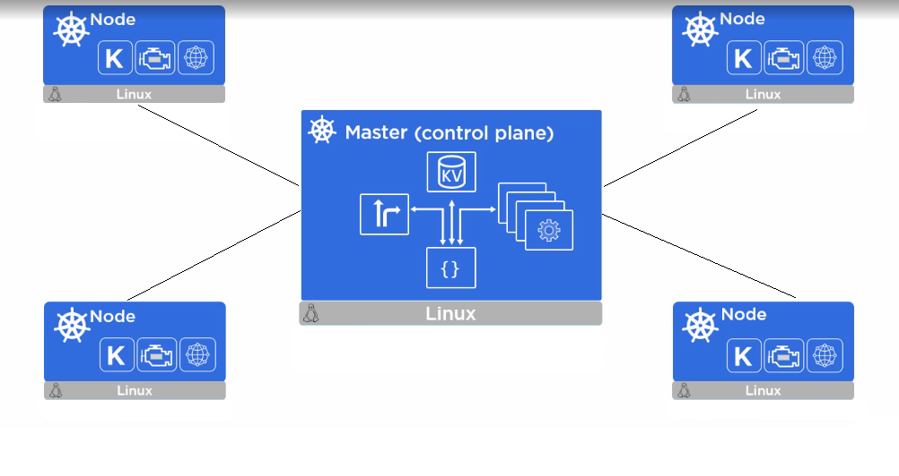

**Kubernetes(K8s)** is an open-source container orchestration system originally developed by Google. The toolkit aims at automated application **deployment, scaling and management** among cluster nodes using container technology. Kubernetes is well known with it's compatibility with container tools including Docker.

You may get deeper look at Kubernetes through the official [documentations](https://kubernetes.io/). Here we only provide a minimal tutorial on GPU cluster setup.

## Contents

1. [What is Container?](#what-is-container?)
2. [Hello Kube - Minikube](#hello-kube---minikube)
	1. [KVM Installation](#kvm-installation)
	2. [Docker Installation](#docker-installation)
	3. [Minikube Installation](#minikube-installation)
3. [References](#references)

## What is Container?

Apache Server, MySQL database, PHP and Wordpress, sometime you may also want to install GUI interface for MySQL with phpMyAdmin. This small page already requires users an hour's time to setup from baremetal nodes.


The web hosting service may only requires little computational power for a modern PC. If you want to deploy another services, would they interfere with each other? Could we reduce the deployment time and isolating different applications? One may say virtual machines (VM) are good choices, however the VMs cannot share low level resources among each other, causing redundant computational power loss. Container technology hence is invented to allow different application to share same OS level resources, thus increase the computational efficiency. 



## Hello Kube - Minikube

Before we start to build the Kubenetes cluster, let's familiarize the basic concept first. To begin with, we will build a single node Kubenetes server. 

**Minikube** is a minimal pack that establishes Kubernetes stack which hosted by local VM engines like VirtualBox or KVM. The small size tool provides ideal environment for local developments and tests.

### Hypervisor Installation

Kubenetes runs on VM engines. We need to get the VM engine (hypervisor) first. Here we demonstrate installation of KVM, while [VirtualBox](https://www.virtualbox.org/wiki/Downloads) also works well with Kubernetes.

1. Check hardware support
	1. Virtualization requires hardware level support. Type
	```bash
	egrep -c '(vmx|svm)' /proc/cpuinfo
	```
	If the returned value is greater than 0 that means your machine is ready for virtualization. Else reboot the computer and enable VT technology in BIOS setting.
	2. Download **kvm-ok** to check hardware compatibility again
	```bash
	sudo apt-get install cpu-checker
	```
	3. Run kvm-ok and verify the output
	```bash
	sudo kvm-ok
	```
	You should see 
	```
	INFO: /dev/kvm exists
	KVM acceleration can be used
	```
2. Install KVM
	Update and install KVM packages
	```bash
	sudo apt update
	sudo apt install qemu qemu-kvm libvirt-bin  bridge-utils  virt-manager
	```
3. Enable and start libvirtd service
	```bash
	sudo service libvirtd start
	sudo update-rc.d libvirtd enable
	```

	You may verify the status of libvirtd with the command:
	```bash
	service libvirtd status
	```

## Docker Installation (Optional)

1. Docker dependencies
	```bash
	sudo apt install apt-transport-https ca-certificates curl software-properties-common
	```
2. Add the GPG key of the official Docker repository
	```bash
	curl -fsSL https://download.docker.com/linux/ubuntu/gpg | sudo apt-key add -
	```
3. Add the Docker repository to the APT sources
	```bash
	sudo add-apt-repository "deb [arch=amd64] https://download.docker.com/linux/ubuntu bionic stable"
	```
4. Update package database again for the newly added repository
	```bash
	sudo apt-get update
	```
5. Check that you are installing from official Docker repo instead of original Ubuntu repo
	```bash
	apt-cache policy docker-ce
	```
	A similar output will be printed:
	```bash
	Output of apt-cache policy docker-ce
	docker-ce:
	  Installed: (none)
	  Candidate: 18.03.1~ce~3-0~ubuntu
	  Version table:
	     18.03.1~ce~3-0~ubuntu 500
	        500 https://download.docker.com/linux/ubuntu bionic/stable amd64 Packages
	```
6. Install Docker
	```bash
	sudo apt install docker-ce
	```
	Up till here Docker should be installed with daemon auto started. Check the docker status with:
	```bash
	sudo systemctl status docker
	```

## Minikube Installation

Ok we finally comes to Kubenetes packages. We need to get **kubectl** and **minikube**.

1. kubectl
	Kubectl is the CLI of Kubernetes, we will discuss it deeper at later chapters. Here we need to install first
	1. Download the latest release
	```bash
	curl -LO https://storage.googleapis.com/kubernetes-release/release/`curl -s https://storage.googleapis.com/kubernetes-release/release/stable.txt`/bin/linux/amd64/kubectl
	```
	2. Change permission for the downloaded binary
	```bash
	chmod +x ./kubectl
	```
	3. Move the binary to user PATH
	```
	sudo install kubectl /usr/local/bin
	```
	4. Test kubectl runs well
	```bash
	kubectl version
	```

2. minikube
	1. Download minikube
	```bash
	curl -Lo minikube https://storage.googleapis.com/minikube/releases/latest/minikube-linux-amd64
	```
	2. Change permission for the downloaded binary
	```bash
	chmod +x minikube
	```
	2. Again you need to add minikube to user PATH
	```bash
	sudo install minikube /usr/local/bin
	```
	3. Test minikube
	```
	minikube
	```
	A list of commands will be displayed.


## References

- [Kubernetes](https://kubernetes.io/)
