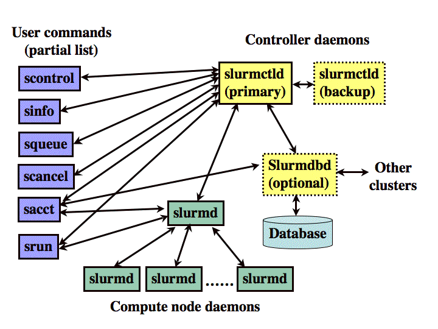

**Slurm** (Simple Linux Utility for Resource Management) is a free and open source job scheduler for Linux and Unix kernel supercomputer and clusters. The software is currently used as the workload manager on about 60% of the Top 500 supercomputers.

You may get deeper look at Slurm through the official [documentations](https://slurm.schedmd.com/documentation.html) and [tutorials](https://slurm.schedmd.com/tutorials.html). Here we only provide a minimal tutorial on GPU cluster setup.

Computation jobs in HPC clusters are run in sequential orders with a specialized scheduling scheme. A scheduler receive user job submissions and arrange job executions in accordance to the priority level. When requested computational resources are available the submitted jobs will be processed in order to fully utilize computation hardwares.

## Slurm Architecture


Slurm is run through Linux daemons for different services:

1. **slurmctld** (Slurm controller daemon)
	- To monitor resources and work
	- Can setup backup controller at multiple nodes for high availability cluster
	- Works at head node
2. **slurmd** (Slurm worker daemon)
	- Works at compute nodes
	- Waits and executes works assigned by **slurmctld** and return computation status
3. **slurmdbd** (Slurm database daemon, optional)
	- Record accounting information into database
	- Necessary when users need to set resources limits

Slurm commands will be explained after the installation.

## Slurm Installation
### Head Node Configuration
1. Login to the head node
2. To make the resolution of worker nodes in the cluster clearer, we may give local hostnames in respect to their IP addresses:
	```bash
	sudo vim /etc/hosts
	```
	Add the associate lines:
	```
	<ip addr of node02>      node02
	<ip addr of node03>      node03
	```
3. Install the Slurm controller package
	```bash
	sudo apt-get install slurm-wlm -y
	```
4. Copy and edit the default Slurm configuration file
	```bash
	cd /etc/slurm-llnl
	cp /usr/share/doc/slurm-client/examples/slurm.conf.simple.gz .
	gzip -d slurm.conf.simple.gz
	sudo mv slurm.conf.simple slurm.conf
	sudo vim slurm.conf
	```
5. Set the controller node info, edit the `slurm.conf` file:
	```
	SlurmctldHost=node01(<ip addr of node01>)
	# e.g.: node01(192.168.1.14)
	```
6. Customize the scheduler algorithm
	HPC cluster jobs can be allocated in different ways. Here we will use the basic "consumable resources" approach. This refers to that each node has a list of consumable resources, including CPU cores, memory and GPUs. The request will be allocated according to default settings unless user specifications. You may edit the `SelectType` field as following:
	```
	SelectType=select/cons_res
	SelectTypeParameters=CR_Core_Memory,CR_CORE_DEFAULT_DIST_BLOCK,CR_ONE_TASK_PER_CORE
	```
7. Set the cluster name
	You may give an arbitrary name to your new cluster at `ClusterName` under `LOGGING AND ACCOUNTING` section:
	```
	ClusterName=mycluster
	```
8. Set the worker nodes
	We need to tell Slurm which computers in the network is used as computational nodes. Near the end of the file, the default file has an example entry for a single worker node. Change it to the one satisfy our setup:
	```
	# here the head node (node01) also act as a worker node
	NodeName=node01 NodeAddr=<ip addr node01> CPUs=40 Sockets=2 CoresPerSocket=20 ThreadsPerCore=1 RealMemory=515896 State=UNKNOWN 
	NodeName=node02 NodeAddr=<ip addr node02> CPUs=40 Sockets=2 CoresPerSocket=20 ThreadsPerCore=1 RealMemory=515896 State=UNKNOWN 
	NodeName=node03 NodeAddr=<ip addr node03> CPUs=40 Sockets=2 CoresPerSocket=20 ThreadsPerCore=1 RealMemory=515896 State=UNKNOWN 
	```
	Here we have identical nodes with dual CPU sockets. Each CPU are running with 20 cores without hyper-threading. RAM size is 515896MB.

	*Kindly reminder: You may reserve a portion of computation resources in head node to prevent worker tasks jamming Slurm controller services, i.e. set CPUs to 36 and reduce the RAM size in the 'slurm.conf' file*

9. Create a partition
	
	Partitions in Slurm groups worker nodes into logical sets. Jobs and resources can be assigned by user to specific partitions with each partition running with different priority rules. This encourages different hardware owners to participate in a single cluster by sharing peripheral devices including controller and storage services.

	At the last line of `slurm.conf`, define the partition:
	```
	PartitionName=partition1 Nodes=node[01-03] Default=YES MaxTime=INFINITE State=UP
	```

	If you want to set a maximum job running time under partition level, you may set `MaxTime=<min, hr:min:00, days-hr:min:00, or days-hr>`, e.g. `MaxTime=60` for 60mins and `MaxTime=2-12:00:00` for 2 days 12 hours run.

10. Configure cgroups:
	Slurm supports Linux [cgroups](https://en.wikipedia.org/wiki/Cgroups) kernel isolation, which will restrict the access to system resources. To tell Slurm which resources are allowed access:
	```
	sudo vim /etc/slurm-llnl.cgroup.conf
	```

	Paste the following:
	```
	CgroupMountpoint="/sys/fs/cgroup"
	CgroupAutomount=yes
	CgroupReleaseAgentDir="/etc/slurm-llnl/cgroup"
	AllowedDevicesFile="/etc/slurm-llnl/cgroup_allowed_devices_file.conf"
	ConstrainCores=yes
	TaskAffinity=no
	ConstrainRAMSpace=yes
	ConstrainSwapSpace=no
	ConstrainDevices=yes
	AllowedRamSpace=100
	AllowedSwapSpace=0
	MaxRAMPercent=100
	MaxSwapPercent=100
	MinRAMSpace=30
	```

	Then you need to whitelist the system devices by creating the file `/etc/slurm-llnl/cgroup_allowed_devices_file.conf`:
	```
	/dev/null
	/dev/urandom
	/dev/zero
	/dev/sda*
	/dev/cpu/*/*
	/dev/pts/*
	/clusterfs*
	```

	To enable memory cgroups for restricting memory allocation by jobs you need to modify the Linux kernel upon bootup:
	```bash
	sudo vim /etc/default/grub
	```

	Chnage the GRUB commandline to:
	```
	GRUB_CMDLINE_LINUX="cgroup_enable=memory swapaccount=1"
	```

	Update GRUB and reboot:
	```
	sudo update-grub
	sudo reboot
	```
11. Copy the configuration files to NFS
	To apply settings to all nodes across the cluster, copy the slurm configuration files and Munge keys to the shared drive:
	```bash
	sudo cp slurm.conf cgroup.conf cgroup_allowed_devices_file.conf /clusterfs
	sudo cp /etc/munge/munge.key /clusterfs
	```

	> Munge acts like key-based SSH for Slurm to communicate among nodes. It generates a private key to be used on all nodes while inter-node signals are encrypted with timestamps. Receiving signals will be decrypted with the identical key. Therefore both time synchronization and `munge.key` are important for Slurm to work properly.
	
12. Start Slurm services
	Restart Munge:
	```bash
	sudo systemctl enable munge
	sudo systemctl start munge
	```

	Restart Slurm worker daemon:
	```bash
	sudo systemctl enable slurmd
	sudo systemctl start slurmd
	```

	Restart Slurm controller daemon:
	```bash
	sudo systemctl enable slurmctld
	sudo systemctl start slurmctld
	```

### Worker node configuration
Repeat this part for all worker nodes except for head node

1. Install Slurm client


## References
[Building a Raspberry Pi Cluster](https://medium.com/@glmdev/building-a-raspberry-pi-cluster-784f0df9afbd)
[Slurm documentation](https://slurm.schedmd.com/documentation.html)
[Ubuntu Slurm](https://github.com/mknoxnv/ubuntu-slurm)